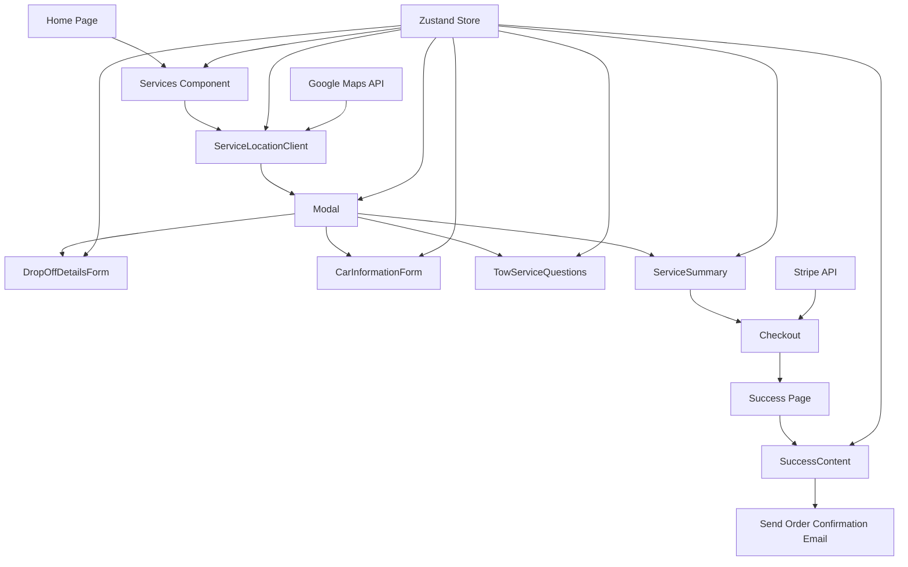
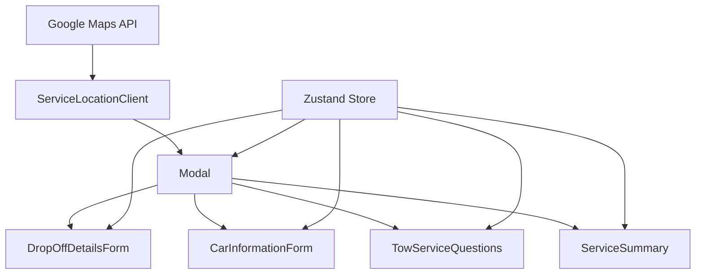

# Roadside Service Dispatch Application Design

## Overview

This application is designed to dispatch roadside services based on customer input. It uses React for the frontend, Next.js for the server-side rendering, and Zustand for state management. The application integrates with Google Maps API for location services and Stripe for payment processing.




## Component Structure

1. **Home Page**
   - Entry point of the application

2. **Services Component**
   - Displays available services
   - Allows users to select a service
   - Code reference:
   ```typescript:src/components/Services.tsx
   startLine: 20
   endLine: 117
   ```

3. **ServiceLocationClient**
   - Handles location input and map display
   - Uses Google Maps API for geocoding and distance calculation
   - Code reference:
   ```typescript:src/components/ServiceLocationClient.tsx
   startLine: 31
   endLine: 288
   ```

4. **Modal**
   - Manages different forms based on the selected service and progress
   - Includes sub-components:
     - DropOffDetailsForm
     - CarInformationForm
     - TowServiceQuestions
     - ContactInformationForm
     - ServiceSummary
   - Code reference:
   
   ```typescript:src/components/Modal.tsx
   startLine: 58
   endLine: 371
   ```




    

5. **TowServiceQuestions**
   - Handles specific questions for tow and tire services
   - Code reference:
   ```typescript:src/components/TowServiceQuestions.tsx
   startLine: 4
   endLine: 100
   ```

6. **ServiceSummary**
   - Displays order details before checkout
   - Initiates the checkout process
   - Code reference:
   ```typescript:src/components/ServiceSummary.tsx
   startLine: 8
   endLine: 174
   ```

7. **SuccessContent**
   - Displays order confirmation after successful payment
   - Triggers email sending process
   - Code reference:
   ```typescript:src/app/success/SuccessContent.tsx
   startLine: 22
   endLine: 132
   ```

## State Management

The application uses Zustand for state management. The store includes:
- Selected service
- Customer details
- Vehicle information
- Service-specific questions
- Location details

Code reference:
```typescript:src/store/store.ts

startLine: 1
endLine: 49
```


## Key Features

1. **Service Selection**: Users can choose from various roadside services.
2. **Location Input**: Utilizes Google Maps API for accurate location services.
3. **Dynamic Forms**: Different forms are presented based on the selected service.
4. **Real-time Distance Calculation**: Calculates distance and estimated time for tow services.
5. **Secure Checkout**: Integrates with Stripe for payment processing.
6. **Order Confirmation**: Sends confirmation emails and displays order details.

## Data Flow

1. User selects a service from the Services component.
2. The application navigates to the ServiceLocationClient for location input.
3. Based on the service, the Modal component presents relevant forms (DropOffDetailsForm, CarInformationForm, TowServiceQuestions).
4. User information is collected through the ContactInformationForm.
5. The ServiceSummary component displays the order details and initiates the checkout process.
6. After successful payment, the SuccessContent component shows the order confirmation and triggers the email sending process.

## Integration Points

1. **Google Maps API**: Used in ServiceLocationClient for location services and distance calculation.
2. **Stripe API**: Integrated in the ServiceSummary component for payment processing.
3. **Email Service**: Triggered in the SuccessContent component for sending order confirmations.

This design allows for a modular and flexible approach to handling different roadside services, with centralized state management and a clear flow from service selection to order confirmation.